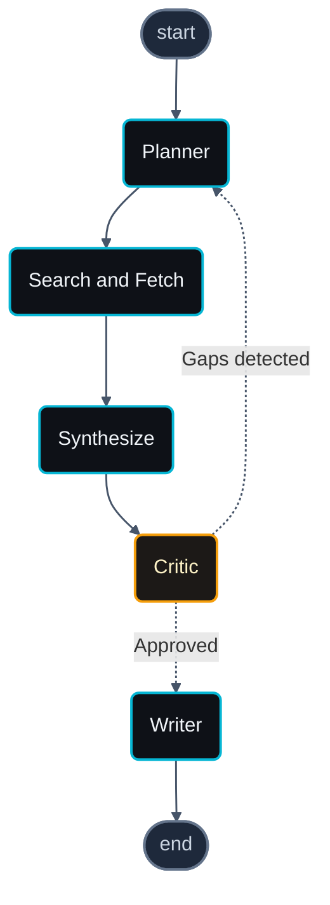

# Deep Research Agent

> An LLM agent that plans, searches the web, reads sources, and synthesizes a Markdown research report with verifiable inline citations.

[](https://www.python.org/)
[](https://docs.astral.sh/ruff/)
[](https://mypy.readthedocs.io/)
[](LICENSE)

---

## What it does

Deep Research Agent turns a single research question into a cited Markdown report. Given a question, it decomposes it into 3–6 atomic sub-questions, runs parallel web searches via Tavily, downloads and extracts the most relevant sources with `trafilatura`, and synthesizes a grounded paragraph per sub-question with inline citations to the real URLs that backed each claim.

A critic node inspects the partial summaries between iterations. If it detects gaps, missing topics, or claims without citations, the planner runs again with the critique as context — the agent keeps refining until the report is comprehensive or the iteration budget is exhausted.

The output is downloadable as Markdown for power users and as a print-ready PDF for everyone else. A Streamlit UI streams each node's progress in real time, so the agent's reasoning is visible while it runs rather than hidden behind a spinner.

The whole pipeline is orchestrated with [LangGraph](https://langchain-ai.github.io/langgraph/), uses OpenAI's structured outputs for typed responses, and is built with `mypy --strict` from day one.

## Architecture



- **Planner** — Decomposes the user question into 3–6 atomic, verifiable sub-questions using OpenAI structured outputs.
- **Search and Fetch** — Parallel Tavily searches, deduplicates URLs, concurrent HTTP fetch, content extraction with trafilatura, token-budget truncation.
- **Synthesize** — One LLM call per sub-question, paragraph output grounded only in the fetched sources with inline `[N]` citations.
- **Critic** — Reviews the partial summaries; returns `has_gaps: bool` plus missing topics if any.
- **Writer** — Assembles the final Markdown report when the critic clears or the iteration budget is hit.

## Architecture decisions

- **LangGraph over a custom loop** — Streaming, conditional edges, and checkpointing for free. Re-implementing the state machine would have been two weeks of glue without portfolio upside.
- **Tavily over DuckDuckGo or HTML scraping** — Tavily's API is designed for LLM agents (relevance-scored JSON, free tier). Scraping search engines is brittle and rate-limited.
- **OpenAI structured outputs over JSON-mode** — `beta.chat.completions.parse` validates each response against a Pydantic model at the API boundary. Invalid shapes fail fast with `LLMRefusalError` instead of producing silent parse errors downstream.
- **Tenacity retries only on transient errors** — `RateLimitError` and `APITimeoutError` get exponential backoff. Every other exception propagates immediately; bugs deserve visibility.
- **Onion architecture (`domain` / `infrastructure` / `agent`)** — `Query`, `Source`, `Report` know nothing about HTTP or LangGraph. The `SearchProvider` Protocol means swapping Tavily for another backend is a single class.
- **Pure-Python PDF export** — `markdown` + `xhtml2pdf`, no WeasyPrint or wkhtmltopdf binaries. Deploys on any OS including HuggingFace Spaces and Streamlit Cloud with a single `pip install`.
- **`astream(stream_mode="updates")`** — The UI receives only the diff each node emits, not the full state. Lower latency in the websocket roundtrip and clearer rendering logic.
- **Strict tooling from day one** — `mypy --strict`, ruff with `N`, `B`, `C90`, `SIM`, `RUF`, `UP`, `ARG`, `PTH`. Pydantic models with `frozen=True`. Upfront cost; no surprise behavior at runtime.

## Quickstart

```bash
git clone https://github.com/<your-user>/deepresearch-agent.git
cd deepresearch-agent
cp .env.example .env   # then edit .env with your OPENAI_API_KEY and TAVILY_API_KEY
uv sync
uv run streamlit run app/streamlit_app.py
```

To run the agent end-to-end from the CLI without the UI:

```bash
uv run python scripts/smoke_test.py --question "Your research question here"
```

## Tech stack

| Layer | Tool |
|---|---|
| Language | Python 3.11+ |
| Orchestration | LangGraph |
| LLM | OpenAI (default `gpt-5.4-mini`) |
| Search | Tavily |
| Models / validation | Pydantic v2 |
| HTTP | httpx (async) |
| Content extraction | trafilatura |
| Tokenization | tiktoken |
| UI | Streamlit with custom CSS |
| PDF export | markdown + xhtml2pdf |
| Logging | structlog |
| Retries | tenacity |
| Package manager | uv |
| Lint / types | ruff + mypy strict |

## Project structure

```
deepresearch-agent/
├── src/deepresearch/
│   ├── config.py                  # pydantic-settings, reads .env
│   ├── domain/
│   │   ├── models.py              # Query, SubQuestion, Source, Citation, Report
│   │   └── exceptions.py          # Domain-specific error hierarchy
│   ├── infrastructure/
│   │   ├── llm.py                 # OpenAI client with retries, structured outputs
│   │   ├── search.py              # SearchProvider Protocol + Tavily impl
│   │   └── fetcher.py             # Concurrent fetch + trafilatura extraction
│   └── agent/
│       ├── state.py               # AgentState TypedDict
│       ├── prompts.py             # Versioned Jinja2 prompt templates
│       ├── nodes.py               # planner, gather_sources, synthesizer, critic, writer
│       └── graph.py               # LangGraph wiring + run_agent entrypoint
├── app/
│   └── streamlit_app.py           # Web UI with streaming progress
├── scripts/
│   ├── smoke_test.py              # End-to-end CLI run
│   └── export_graph.py            # Renders the graph to docs/images
├── docs/images/                   # Architecture diagram (.mmd and .png)
├── .streamlit/config.toml         # Forces dark theme for the app
├── .env.example
├── pyproject.toml                 # uv, ruff (strict), mypy (strict)
└── README.md
```

## Roadmap

- Per-sub-question source filtering to cut synthesizer token cost by ~70%
- Unit and integration test suite with `pytest` and `vcrpy` cassettes
- Eval harness with metrics: `citation_coverage`, `topic_coverage`, `latency_p95`, `cost_per_query`
- Deployment to HuggingFace Spaces with a public demo link
- Optional LangSmith tracing for production observability
- Multi-provider LLM support behind a thin abstraction (Anthropic, OpenRouter, local models)

## License

MIT. See [LICENSE](LICENSE).
